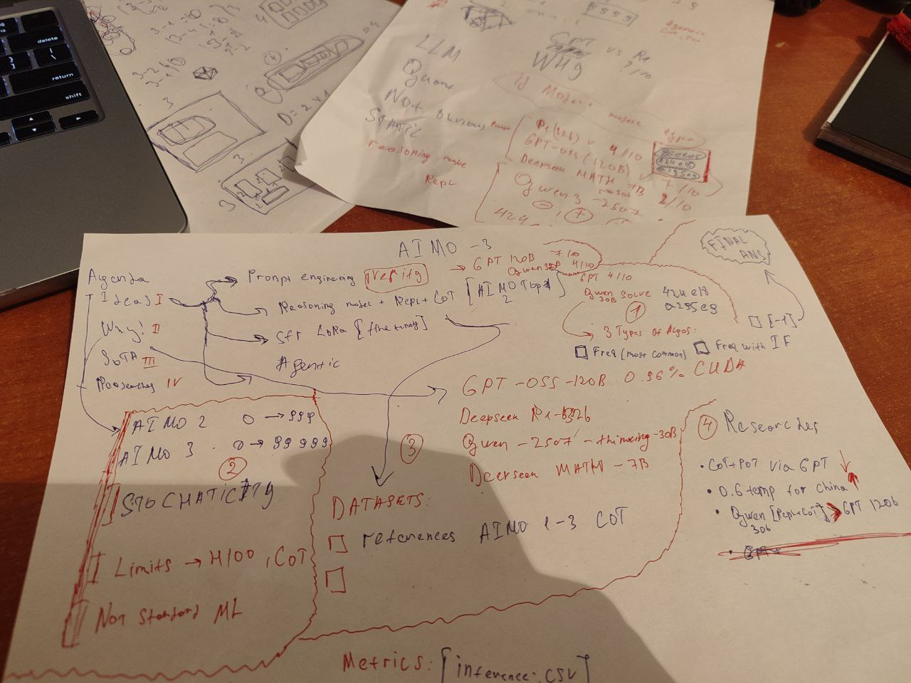

# report-AIMO3


presentation: 

# Prompt Eng. via Verifying ([https://www.kaggle.com/code/nurikw3/streaming-inference](https://www.kaggle.com/code/nurikw3/streaming-inference)) how it works?

- How it work
- Research`s

## Solution Architecture

- **vLLM server** - launches a local server with the GPT-OSS-120B large language model (120 billion parameters) that will generate solutions to mathematical problems
- **OpenAI-compatible API** - the server provides an OpenAI API-compatible interface for communicating with the model via HTTP requests
- **Parallel generation** - the system can process up to 4 requests simultaneously (`max-num-seqs: 4`)

## Problem-Solving Process

- **Initial generation** - for each problem, 4 parallel solution attempts are launched with temperature=1.0 (randomness in answers)
- **Streaming response** - the model generates the solution in chunks (streaming), allowing early stopping when conditions are met
- **Answer extraction** - the final answer is extracted from the solution text in `\boxed{number}` format using regular expressions
- **Validation** - checks that the answer is an integer between 0 and 99999

## Follow-up Question Mechanism

- **If answer not in proper format** - the system automatically adds a clarifying question "Place your final answer in \boxed{}"
- **If answer too small** (≤10) - asks "Are you sure that is the answer?"
- **If GPU usage is low** (<10%) - asks "Have you verified your answer?" to make the model double-check
- **If generation too long** (>50k tokens) - requests an educated guess

## Voting System

- **Collecting answers** - all obtained answers from different attempts are stored in a `Counter` for each problem
- **Weighted voting** - each answer receives weight `log(1.25 + |value|) × count`, which penalizes numbers that are too small
- **Early stopping** - if one answer scores enough points and leads significantly over others, the problem is considered solved and generation stops
- **Final selection** - at the end, the answer with the maximum weighted score is chosen

## Resource Management

- **GPU KV-cache monitoring** - tracks GPU memory usage through vLLM logs
- **Time constraints** - each problem has a time limit from the `cutoff_times` array
- **Token limiting** - generation stops after 60k tokens to prevent hanging
- **Saving intermediate results** - all solution attempts are saved to the `solutions/` folder for analysis

# Reasoning model + Custom Repl + CoT 3 algo types

## Solution Architecture

- **Direct vLLM integration** - uses vLLM library directly instead of API server, loads Qwen-3-30B MoE model (30B parameters)
- **Multiple system prompts** - creates 5 parallel conversations with different "thinking styles" for diversity

## Problem-Solving Process

- **Batch generation** - processes all 5 conversations simultaneously in one vLLM call
- **Dual answer extraction** - gets answers from both `\boxed{}` format AND by executing Python code blocks found in responses
- **Python code execution** - runs any `python` code blocks in a subprocess sandbox with 8-second timeout

## Multi-Round Refinement

- **Iterative conversations** - continues generating for conversations that haven't produced answers yet
- **Selective continuation** - only keeps "alive" the conversation threads without valid answers
- **Combined answers** - collects all answers from both boxed format and code execution across all rounds

## Voting System

- **All-unique fallback** - if all answers appear only once, takes the **last** generated answer
- **Majority voting** - otherwise selects most frequent answer or [-1] or if not any freq it will be [-1]
- **Answer tracking** - globally records which conversation thread (0-4) contributed each answer

## Researchs

- With all this tools Qwen30B (which is four times less than the gpt) was able to solve the problems that the gpt model could not solve
- Optimal temp to this models is 0.6
- if you remove Multiple system prompts, there is no significant deterioration.

# Ideas

# **Fine-Tuning**

### **1. Make training data**

- take **reference.csv** from AIMO3
- take **AIMO2 reference**
- take **AIMO1 reference**
- structure each sample like:

**input:** the problem text

**output:** chain-of-thought + final answer

(done by prompting a strong model)

---

### **2. Generate CoT**

- use a stronger model (Gemma 2 27B / Qwen2.5-72B / DeepSeek-r1)
- for each problem:
    
    → ask it to solve with step-by-step reasoning
    
- save everything into JSONL

---

### **3. Clean data**

- remove hallucinated answers
- keep format consistent:

```
[THINKING...]
steps...
steps...
[/THINKING]
Final answer: X

```

---

### **4. Fine-tune the model (SFT)**

- take the base model you want to use for inference (Qwen 7B / 14B / 32B etc.)
- train with LoRA
